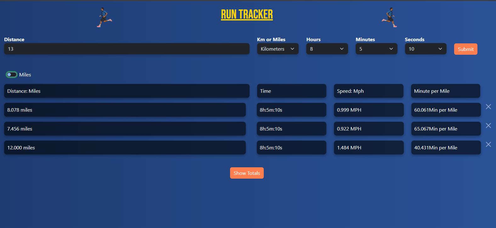
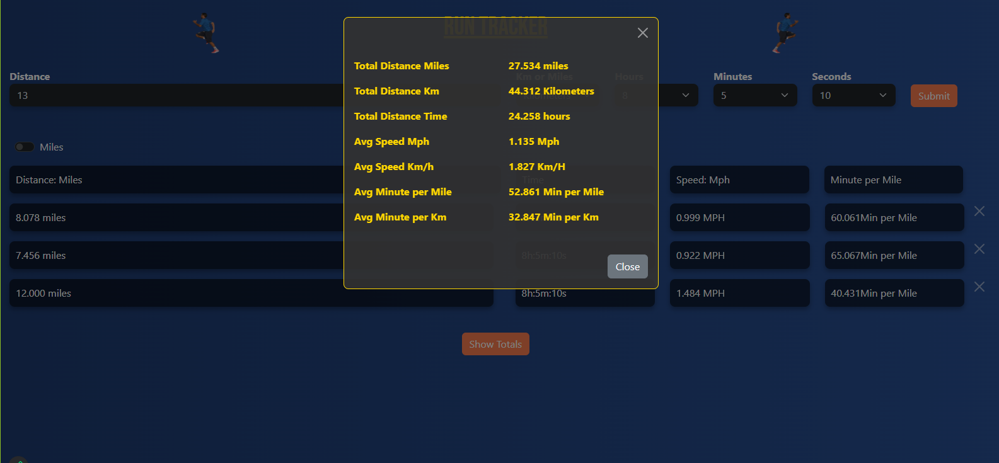

# Run Tracking Website

## Description

We have created a simple run tracking website to track a persons runs and calculate stats. Runs are tracked by distance either in miles or in Kilometers and by time. Using this information, the stats of Average speed and minute split per unit are calculated as well. The website also tabulates total distance and time ran, along with average speed per unit and minute split per unit. This website can help runners track their runs over a period of time and have log of different metrics to help in future runs. 

## Table of Contents
- [Installation](#installation)
- [Usage](#usage)
- [Credits](#credits)

## Installation

No installation is required. Just run the website in your preferred browser.

## Usage

Runs can be added by entering a distance, selecting the unit of distance, entering the time in hours, minutes, and seconds, and clicking the submit button.

The runs displayed can be displayed in eather miles or kilometers and can be removed by clicking the X button associated to the run.

When clicking the show totals button, a modal popups on screen to display the total miles and kilometers run, total time run, and the average speeds and time splits per unit.

## Credits

* Vijay Natarajan (github.com/santoshalper)
* Byron Tobe (github.com/Thefoolzerrand)
* Obi Mazagri (github.com/mazagri3)